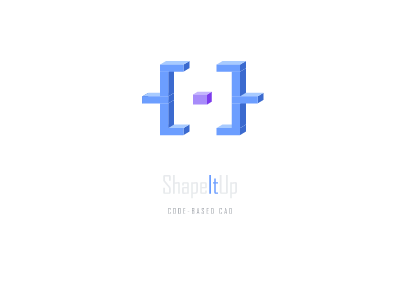

<p align="center">
  
</p>

<p align="center">
  <strong>Scripted CAD for AI agents and humans</strong> — write TypeScript, get CAD.
</p>

<p align="center">
  <a href="https://github.com/asbis/ShapeItUp/blob/master/LICENSE"></a>
  <a href="https://www.npmjs.com/package/@shapeitup/mcp-server"></a>
</p>

---

ShapeItUp is an MCP server that turns [Replicad](https://replicad.xyz) / OpenCascade into AI-agent-grade CAD tooling. It writes, renders, verifies, and exports parametric 3D models from TypeScript `.shape.ts` files, headlessly — from the terminal, from Claude Code / Cursor / Claude Desktop, or from CI. A [VSCode extension](#vscode-extension-optional) is available as an optional interactive viewer for humans who want to watch the renders happen live.

## Install for Claude Code

```bash
claude mcp add shapeitup -- npx -y @shapeitup/mcp-server
```

That's it. `claude mcp add` registers the server in your Claude Code config so agent sessions pick it up automatically. See the [Claude Code MCP docs](https://docs.claude.com/en/docs/claude-code/mcp) for scoping options (`-s user` for all projects, `-s project` for just this repo).

## Install for Cursor / Claude Desktop / other MCP clients

The generic MCP-config snippet:

```json
{
  "mcpServers": {
    "shapeitup": {
      "command": "npx",
      "args": ["-y", "@shapeitup/mcp-server"]
    }
  }
}
```

Where to put it:

- **Cursor** — `~/.cursor/mcp.json`, or Settings → MCP → *Add new server* to drop it in through the UI.
- **Claude Desktop** — `~/Library/Application Support/Claude/claude_desktop_config.json` on macOS, `%APPDATA%\Claude\claude_desktop_config.json` on Windows. Restart the app after editing.
- **Any stdio MCP client** — hand it `npx -y @shapeitup/mcp-server` as the server command.

Node 20+ required. No native build step; everything ships as WASM.

## What you get

A CAD toolkit agents can drive end to end:

- **Authoring** — `create_shape`, `modify_shape`, `read_shape`, `list_shapes`, `setup_shape_project`
- **Rendering** — `render_preview`, `preview_shape`, `get_preview` (SVG-first, resvg-backed PNGs)
- **Verification** — `verify_shape`, `check_collisions`, `sweep_check`, `describe_geometry`, `validate_joints`
- **Iteration** — `tune_params` (slider overrides), `set_render_mode`, `toggle_dimensions`
- **Export** — `export_shape` (STEP / STL / OBJ / 3MF)
- **stdlib** — `holes`, `screws` / `bolts` / `washers` / `inserts`, `bearings`, `extrusions`, `patterns`, `threads`, `joints` + `assemble`, `printHints`, and more — all importable from `"shapeitup"` inside any `.shape.ts`

Full tool list: 25 MCP tools covering the create → preview → verify → tune → export loop.

## Quick example

Prompt to the agent: *"I want a mounting bracket, 60×40×4 mm, four M3 through-holes in the corners."* The agent calls `create_shape` and writes:

```typescript
// bracket.shape.ts
import { drawRoundedRectangle } from "replicad";
import { holes } from "shapeitup";

export const params = { width: 60, depth: 40, thickness: 4, holeInset: 6 };

export default function main({ width, depth, thickness, holeInset }: typeof params) {
  const plate = drawRoundedRectangle(width, depth, 3)
    .sketchOnPlane("XY")
    .extrude(thickness);

  return holes.through(plate, "M3", [
    [-width/2 + holeInset, -depth/2 + holeInset, 0],
    [ width/2 - holeInset, -depth/2 + holeInset, 0],
    [-width/2 + holeInset,  depth/2 - holeInset, 0],
    [ width/2 - holeInset,  depth/2 - holeInset, 0],
  ]);
}
```

Then it calls `render_preview` and gets back a PNG it can inspect, plus bounding-box + volume metadata to sanity-check against the spec. If the user wants the holes bigger, the agent calls `tune_params` — no file rewrite needed.

## Running in CI / containers

`npx -y @shapeitup/mcp-server` works anywhere Node 20 runs — Docker, GitHub Actions, GitLab CI. Renders go through `@resvg/resvg-wasm`; no GPU, no headless Chromium, no native graphics stack required. A cold boot on a stock Node image typically takes ~3 s for the first render (OCCT WASM compile) and < 200 ms thereafter.

## VSCode extension (optional)

There is a VSCode extension that subscribes to the MCP server's event bus and shows a live Three.js viewer in the side panel — useful when you want to watch an agent work, or to drive ShapeItUp interactively. Install it from the VS Code marketplace (search for "ShapeItUp") or build from source (see [Development](#development)).

The extension is entirely optional: the MCP server is headless on its own, does not require VSCode to be running, and produces the same renders whether or not a viewer is attached.

## Development

```bash
git clone https://github.com/asbis/ShapeItUp.git
cd ShapeItUp
pnpm install
pnpm build          # builds extension, viewer, worker, and mcp-server
pnpm dev            # watch mode
pnpm lint           # tsc -b across packages
```

Then press **F5** in VS Code to launch the Extension Development Host if you want to iterate on the viewer.

Project layout:

```
packages/
  mcp-server/   -- standalone MCP server (this is the npm package)
  core/         -- Replicad wrappers, stdlib, execution engine (bundled into mcp-server)
  shared/       -- cross-package types (bundled into mcp-server)
  extension/    -- VSCode extension (optional viewer)
  viewer/       -- Three.js viewer surface for the extension
  worker/       -- OCCT WASM web-worker for the extension viewer
```

See [CONTRIBUTING.md](CONTRIBUTING.md) for contribution guidelines.

## License

MIT
